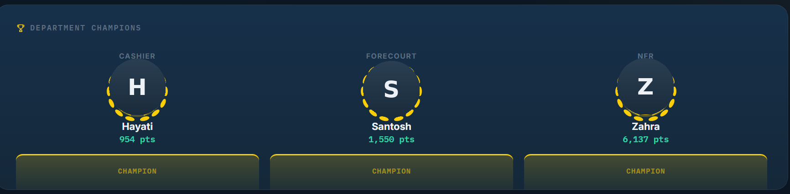

# OneTrack

A live, gamified performance dashboard built for a real retail site — a petrol station operated by RCS Sg Bakap Resources. Staff performance data lives in a Google Sheet; this dashboard turns it into a leaderboard, trend charts, and department "champions" display, refreshed automatically and rendered for a wall-mounted TV.

No backend, no build step, no framework — a single static HTML file, hosted free on GitHub Pages, pulling live data straight from Google Sheets.

---

## What it does

- **Live leaderboard** — per-department rankings, refreshed every 5 minutes straight from the source spreadsheet
- **Department Champions** — top performer per department, shown as equals rather than ranked against each other (departments cover different metrics and aren't directly comparable)
- **Momentum tracking** — "Most Improved" (self-comparison, not against others) and "Hot Streaks" (consecutive active days)
- **Achievement trend + weekly rhythm charts** — hand-rolled inline SVG, no charting library
- **Weighted scoring** — tasks are weighted by difficulty (Easy / Medium / High), not counted as flat units — configurable entirely from the spreadsheet, no code changes needed
- **TV display mode** (`?tv=1`) — handles physical screen rotation, auto-scales to fit any resolution, and keeps text/charts/photos sharp using CSS `zoom` rather than a blurry `transform: scale()`

## How it's built

- Plain HTML, CSS, and vanilla JavaScript — everything in `index.html`
- Data fetched client-side via Google's `gviz` endpoint (no API key, no server)
- Every column is looked up **by header name**, not position — a renamed or reordered spreadsheet column fails loudly with a clear error instead of silently corrupting data
- Sheet-sourced text is HTML-escaped before rendering

## Setup

1. Make a copy of the Google Sheet structure this expects (tabs: `Department_Winners_Clean`, `Dept_Ranking_Clean`, `Clean_Daily_Input`, `Clean_Target_Master`, `Achievement_Trend_Clean`, `Metric_Weights`)
2. Share it as **Anyone with the link → Viewer** (required — this is a static site with no backend, so the sheet must be publicly link-accessible)
3. Drop your Sheet ID into the `SHEET_ID` constant near the top of the `<script>` block
4. Enable GitHub Pages on this repo (Settings → Pages → Deploy from branch)
5. Add your own logo(s) to `/assets` if you want branding in the header/footer

## TV / kiosk display

Load the site with `?tv=1` appended to the URL (e.g. `https://yourdomain.github.io/one-track-v2/?tv=1`) to activate rotation and auto-fit mode for a portrait-mounted screen. The plain URL (no query param) renders normally for a phone, laptop, or any other screen.

## Known limitations

- Because this is a static site with no backend, the Google Sheet must be link-shared as public-viewable — anyone with the link can view (but not edit, if permissions are set correctly) the raw spreadsheet directly, not just what the dashboard displays
- The dashboard refreshes its *data* every 5 minutes, but never reloads its own *code* — a long-running kiosk browser should be set to periodically hard-refresh so future updates actually reach the display
- Built for one specific site's department structure and scoring rules — adapting it elsewhere means editing the metric list and department scope hardcoded in the script

## Credits

Built for RCS Sg Bakap Resources · Shell branding used with permission for internal display purposes only.
